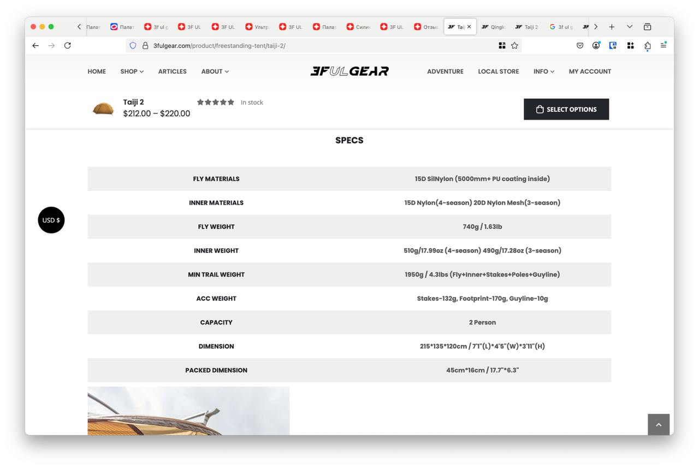

# March 2025 - ♻️ Bin. General. Notes - Uuuuuuuuuu-u

[♻️ Bin. General. Notes - Uuuuuuuuuu-u](../../)

---

### Post 11033

Taiji 2  FLY WEIGHT - 740g INNER WEIGHT - 510g MIN TRAIL WEIGHT - 1950g (Fly+Inner+Stakes+Poles+Guyline) ACC WEIGHT - Stakes-132g, Footprint-170g, Guyline-10g DIMENSION - 215*135*120cm PACKED DIMENSION - 45cm*16cm    Qingkong 3  FLY WEIGHT - 676g INNER WEIGHT - 800g FULL WEIGHT - 1920g (not including Repair Kit, Pegs) DIMENSION - 210 *170*125cm PACKED DIMENSION - 55cm*17cm

2025-03-01 - 00:22:40

---

### Post 11032

 
 

2025-03-01 - 00:18:09

🗂 file: [11032-photo.jpg](11032-photo.jpg) 

---

### Post 11031

 
 

2025-03-01 - 00:18:09

🗂 file: [11031-photo.jpg](11031-photo.jpg) 

---

### Post 11030

 
 

2025-03-01 - 00:18:05

🗂 file: [11030-photo.jpg](11030-photo.jpg) 

---

### Post 11029

 
 

2025-03-01 - 00:18:05

🗂 file: [11029-photo.jpg](11029-photo.jpg) 

---

### Post 11028

 
 

2025-03-01 - 00:18:05

🗂 file: [11028-photo.jpg](11028-photo.jpg) 

