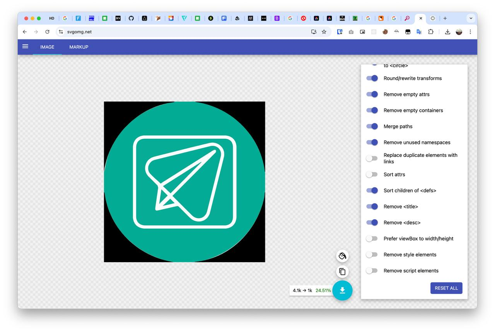
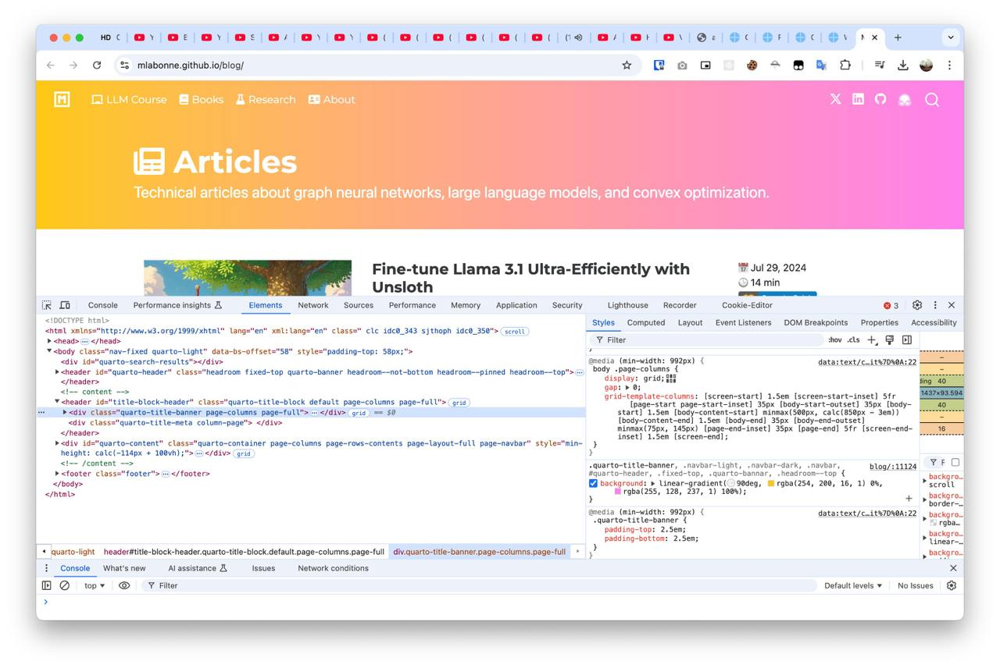

# December 2024 - 🐊 IT. Archivium - Uuuuuuuuuu-u

[🐊 IT. Archivium - Uuuuuuuuuu-u](../../)

---

### Post 677

2024-12-27 - 00:22:59

<a href="https://docs.maptiler.com/sdk-js/examples/helper-polyline-gpx/">https://docs.maptiler.com/sdk-js/examples/helper-polyline-gpx/</a>

---

### Post 676

2024-12-27 - 00:22:42

<a href="https://docs.maptiler.com/sdk-js/examples/helper-polyline-minimal/">https://docs.maptiler.com/sdk-js/examples/helper-polyline-minimal/</a>

---

### Post 675

2024-12-27 - 00:22:08

<a href="https://docs.maptiler.com/sdk-js/examples/weather-custom-dataset-population-density/">https://docs.maptiler.com/sdk-js/examples/weather-custom-dataset-population-density/</a>

---

### Post 674

2024-12-27 - 00:21:50

<a href="https://docs.maptiler.com/sdk-js/examples/local-geojson/">https://docs.maptiler.com/sdk-js/examples/local-geojson/</a>

---

### Post 673

2024-12-27 - 00:20:51

<a href="https://docs.maptiler.com/sdk-js/examples/live-update-feature/">https://docs.maptiler.com/sdk-js/examples/live-update-feature/</a>

---

### Post 672

2024-12-27 - 00:20:31

<a href="https://docs.maptiler.com/sdk-js/examples/toogle-deck-gl-layer/">https://docs.maptiler.com/sdk-js/examples/toogle-deck-gl-layer/</a>

---

### Post 671

2024-12-27 - 00:20:13

<a href="https://docs.maptiler.com/sdk-js/examples/data-driven-lines/">https://docs.maptiler.com/sdk-js/examples/data-driven-lines/</a>

---

### Post 670

2024-12-27 - 00:20:01

<a href="https://docs.maptiler.com/sdk-js/examples/elevation-profile-control-zoomed-section/">https://docs.maptiler.com/sdk-js/examples/elevation-profile-control-zoomed-section/</a>

---

### Post 669

2024-12-27 - 00:19:17

<a href="https://docs.maptiler.com/sdk-js/examples/elevation-profile-control-marker/">https://docs.maptiler.com/sdk-js/examples/elevation-profile-control-marker/</a>

---

### Post 668

2024-12-27 - 00:19:12

<a href="https://docs.maptiler.com/sdk-js/examples/polygon-popup-on-click/">https://docs.maptiler.com/sdk-js/examples/polygon-popup-on-click/</a>

---

### Post 667

2024-12-27 - 00:18:53

<a href="https://docs.maptiler.com/sdk-js/examples/geocoding-reverse-json/">https://docs.maptiler.com/sdk-js/examples/geocoding-reverse-json/</a>

---

### Post 666

2024-12-27 - 00:18:28

<a href="https://docs.maptiler.com/sdk-js/examples/event-ready/">https://docs.maptiler.com/sdk-js/examples/event-ready/</a>

---

### Post 665

2024-12-27 - 00:17:41

<a href="https://docs.maptiler.com/sdk-js/examples/elevation-at/">https://docs.maptiler.com/sdk-js/examples/elevation-at/</a>

---

### Post 664

2024-12-27 - 00:17:18

<a href="https://docs.maptiler.com/sdk-js/examples/elevation-profile-control-gpx/">https://docs.maptiler.com/sdk-js/examples/elevation-profile-control-gpx/</a>

---

### Post 663

2024-12-27 - 00:15:25

<a href="https://docs.maptiler.com/sdk-js/examples/queryrenderedfeatures/">https://docs.maptiler.com/sdk-js/examples/queryrenderedfeatures/</a>

---

### Post 662

2024-12-27 - 00:14:12

<a href="https://docs.maptiler.com/sdk-js/examples/filter-markers/">https://docs.maptiler.com/sdk-js/examples/filter-markers/</a>

---

### Post 661

2024-12-27 - 00:13:50

<a href="https://docs.maptiler.com/sdk-js/examples/elevation-profile-control-simple/">https://docs.maptiler.com/sdk-js/examples/elevation-profile-control-simple/</a>

---

### Post 660

2024-12-27 - 00:13:08

<a href="https://docs.maptiler.com/sdk-js/examples/popup-on-hover/">https://docs.maptiler.com/sdk-js/examples/popup-on-hover/</a>

---

### Post 659

2024-12-27 - 00:12:58

<a href="https://docs.maptiler.com/sdk-js/examples/popup-on-click/">https://docs.maptiler.com/sdk-js/examples/popup-on-click/</a>

---

### Post 658

2024-12-27 - 00:12:13

<a href="https://docs.maptiler.com/sdk-js/examples/elevation-profile-control-customized/">https://docs.maptiler.com/sdk-js/examples/elevation-profile-control-customized/</a>

---

### Post 657

2024-12-27 - 00:11:53

<a href="https://docs.maptiler.com/sdk-js/examples/add-deck-gl-layer-rest-api/">https://docs.maptiler.com/sdk-js/examples/add-deck-gl-layer-rest-api/</a>

---

### Post 656

2024-12-27 - 00:10:07

<a href="https://docs.maptiler.com/sdk-js/examples/color-switcher/">https://docs.maptiler.com/sdk-js/examples/color-switcher/</a>

---

### Post 655

2024-12-27 - 00:09:58

<a href="https://docs.maptiler.com/sdk-js/examples/set-popup/">https://docs.maptiler.com/sdk-js/examples/set-popup/</a>

---

### Post 654

2024-12-27 - 00:08:12

<a href="https://docs.maptiler.com/sdk-js/examples/landmarks-interactions/">https://docs.maptiler.com/sdk-js/examples/landmarks-interactions/</a>

---

### Post 653

2024-12-27 - 00:07:37

<a href="https://docs.maptiler.com/sdk-js/examples/vector-source/">https://docs.maptiler.com/sdk-js/examples/vector-source/</a>

---

### Post 652

2024-12-27 - 00:07:28

<a href="https://docs.maptiler.com/sdk-js/examples/third-party/">https://docs.maptiler.com/sdk-js/examples/third-party/</a>

---

### Post 651

2024-12-27 - 00:05:52

<a href="https://docs.maptiler.com/sdk-js/examples/geojson-layer-in-stack/">https://docs.maptiler.com/sdk-js/examples/geojson-layer-in-stack/</a>

---

### Post 650

2024-12-27 - 00:04:48

<a href="https://docs.maptiler.com/sdk-js/examples/contour-lines/">https://docs.maptiler.com/sdk-js/examples/contour-lines/</a>

---

### Post 649

2024-12-27 - 00:04:17

<a href="https://docs.maptiler.com/sdk-js/examples/control-legend/">https://docs.maptiler.com/sdk-js/examples/control-legend/</a>

---

### Post 648

2024-12-27 - 00:03:46

<a href="https://docs.maptiler.com/sdk-js/examples/control-style-switcher/">https://docs.maptiler.com/sdk-js/examples/control-style-switcher/</a>

---

### Post 647

2024-12-27 - 00:03:30

<a href="https://docs.maptiler.com/sdk-js/examples/control-scale/">https://docs.maptiler.com/sdk-js/examples/control-scale/</a>

---

### Post 646

2024-12-27 - 00:03:02

<a href="https://docs.maptiler.com/sdk-js/examples/map-terrain/">https://docs.maptiler.com/sdk-js/examples/map-terrain/</a>

---

### Post 645

2024-12-27 - 00:02:40

<a href="https://docs.maptiler.com/sdk-js/examples/list-of-places/">https://docs.maptiler.com/sdk-js/examples/list-of-places/</a>

---

### Post 644

2024-12-27 - 00:01:04

<a href="https://docs.maptiler.com/sdk-js/examples/geocoder-component/">https://docs.maptiler.com/sdk-js/examples/geocoder-component/</a>

---

### Post 643

2024-12-27 - 00:00:43

<a href="https://docs.maptiler.com/sdk-js/examples/reverse-geocoding/">https://docs.maptiler.com/sdk-js/examples/reverse-geocoding/</a>

---

### Post 642

2024-12-26 - 23:58:43

<a href="https://docs.maptiler.com/sdk-js/examples/custom-map/">https://docs.maptiler.com/sdk-js/examples/custom-map/</a>

---

### Post 641

2024-12-26 - 23:58:03

<a href="https://docs.maptiler.com/sdk-js/examples/geojson-multigeometry/">https://docs.maptiler.com/sdk-js/examples/geojson-multigeometry/</a>

---

### Post 640

2024-12-25 - 22:51:08

<a href="https://docs.maptiler.com/sdk-js/examples/elevation-profile-control-customized/">https://docs.maptiler.com/sdk-js/examples/elevation-profile-control-customized/</a>

---

### Post 639

2024-12-25 - 22:50:27

<a href="https://docs.maptiler.com/sdk-js/examples/elevation-profile-control-customized/">https://docs.maptiler.com/sdk-js/examples/elevation-profile-control-customized/</a>

---

 
 

### Post 638

2024-12-25 - 22:47:27

🗂 File: [638-photo.jpg](638-photo.jpg) 

---

### Post 637

2024-12-24 - 21:44:15

Choose one of these options.  Exit in seconds: 8

---

### Post 636

2024-12-24 - 21:44:14

<a href="https://youtu.be/jj53cCZ0wFg?si=ccBpYalv6MHCG3WL">https://youtu.be/jj53cCZ0wFg?si=ccBpYalv6MHCG3WL</a>

---

### Post 635

2024-12-23 - 02:13:14

&#x27;3.4.2&#x27;: [&#x27;Only&#x27;, &#x27;3.10&#x27;, &#x27;3.11&#x27;, &#x27;3.12&#x27;, &#x27;3.13&#x27;, &#x27;3.9&#x27;, &#x27;CPython&#x27;, &#x27;PyPy&#x27;],  &#x27;4.0.0&#x27;: [&#x27;Only&#x27;, &#x27;3.10&#x27;, &#x27;3.11&#x27;, &#x27;3.12&#x27;, &#x27;3.13&#x27;, &#x27;3.9&#x27;, &#x27;CPython&#x27;, &#x27;PyPy&#x27;],  &#x27;4.1.0&#x27;: [&#x27;Only&#x27;, &#x27;3.10&#x27;, &#x27;3.11&#x27;, &#x27;3.12&#x27;, &#x27;3.13&#x27;, &#x27;3.9&#x27;, &#x27;CPython&#x27;, &#x27;PyPy&#x27;],  &#x27;4.1.1&#x27;: [&#x27;Only&#x27;, &#x27;3.10&#x27;, &#x27;3.11&#x27;, &#x27;3.12&#x27;, &#x27;3.13&#x27;, &#x27;3.9&#x27;, &#x27;CPython&#x27;, &#x27;PyPy&#x27;],  &#x27;4.2.0&#x27;: [&#x27;Only&#x27;, &#x27;3.10&#x27;, &#x27;3.11&#x27;, &#x27;3.12&#x27;, &#x27;3.13&#x27;, &#x27;3.9&#x27;, &#x27;CPython&#x27;, &#x27;PyPy&#x27;],  &#x27;4.2.1&#x27;: [&#x27;Only&#x27;, &#x27;3.10&#x27;, &#x27;3.11&#x27;, &#x27;3.12&#x27;, &#x27;3.13&#x27;, &#x27;3.9&#x27;, &#x27;CPython&#x27;, &#x27;PyPy&#x27;],  &#x27;4.3.0&#x27;: [&#x27;Only&#x27;, &#x27;3.10&#x27;, &#x27;3.11&#x27;, &#x27;3.12&#x27;, &#x27;3.13&#x27;, &#x27;3.9&#x27;, &#x27;CPython&#x27;, &#x27;PyPy&#x27;

---

### Post 634

2024-12-23 - 02:13:06

import requests from pprint import pprint  def get_compatible_versions(package_name, python_version):     &quot;&quot;&quot;     Получает список версий пакета, совместимых с указанной версией Python.      :param package_name: str, имя пакета на PyPI     :param python_version: str, версия Python (например, &#x27;3.7&#x27;)     :return: list, список подходящих версий пакета     &quot;&quot;&quot;     url = f&quot;<a href="https://pypi.org/pypi/{package_name}/json">https://pypi.org/pypi/{package_name}/json</a>&quot;     response = requests.get(url)      if response.status_code != 200:         raise ValueError(f&quot;Ошибка запроса: {response.status_code}&quot;)      data = response.json()     versions = data.get(&#x27;releases&#x27;, {})     compatible_versions = []      for version, details in versions.items():         if not details:  # Пропустить, если деталей нет             continue         requires_python = details[0].get(&#x27;requires_python&#x27;)         v_python_version = details[0].get(&#x27;python_version&#x27;)          print(version)         print(requires_python)         print(v_python_version)         print()           if not requires_python or &#x27;,&#x27; in requires_python:  # Пропуск условий с диапазонами             continue         min_version = requires_python.replace(&#x27;&gt;=&#x27;, &#x27;&#x27;)           if float(min_version) &lt;= float(python_version):             compatible_versions.append(version)          print()      return compatible_versions  # Пример использования python_version = &#x27;3.10&#x27; package_name = &#x27;pillow&#x27; compatible_versions = get_compatible_versions(package_name, python_version)  print(&quot;Подходящие версии:&quot;) pprint(compatible_versions)   import requests from pprint import pprint  def get_package_metadata(package_name):     &quot;&quot;&quot;     Получает метаданные пакета, включая Classifiers.      :param package_name: str, имя пакета на PyPI     :return: dict, метаданные пакета     &quot;&quot;&quot;     url = f&quot;<a href="https://pypi.org/pypi/{package_name}/json">https://pypi.org/pypi/{package_name}/json</a>&quot;     response = requests.get(url)      if response.status_code != 200:         raise ValueError(f&quot;Ошибка запроса: {response.status_code}&quot;)      data = response.json()     info = data.get(&#x27;info&#x27;, {})     classifiers = info.get(&#x27;classifiers&#x27;, [])      # Парсинг ключевых данных из classifiers     metadata = {         &quot;Programming Language&quot;: [cls for cls in classifiers if cls.startswith(&quot;Programming Language&quot;)]     }      return metadata  # Пример использования package_name = &quot;pillow&quot; metadata = get_package_metadata(package_name)  print(&quot;Метаданные пакета:&quot;) pprint(metadata)    print(&#x27;===&#x27;*10)  import requests from pprint import pprint  def get_python_versions_for_package(package_name):     &quot;&quot;&quot;     Получает версии Python, поддерживаемые всеми версиями пакета.      :param package_name: str, имя пакета на PyPI     :return: dict, где ключи - версии пакета, значения - поддерживаемые версии Python     &quot;&quot;&quot;     url = f&quot;<a href="https://pypi.org/pypi/{package_name}/json">https://pypi.org/pypi/{package_name}/json</a>&quot;     response = requests.get(url)      if response.status_code != 200:         raise ValueError(f&quot;Ошибка запроса: {response.status_code}&quot;)      data = response.json()     releases = data.get(&#x27;releases&#x27;, {})     info = data.get(&#x27;info&#x27;, {})     all_classifiers = info.get(&#x27;classifiers&#x27;, [])      # Извлечение всех Python версий из classifiers     supported_python_versions = [         classifier.split(&quot;::&quot;)[-1].strip()         for classifier in all_classifiers         if classifier.startswith(&quot;Programming Language :: Python ::&quot;)     ]      # Сопоставление с каждой версией пакета     version_support = {}     for version, details in releases.items():         if details:             version_support[version] = supported_python_versions      return version_support  # Пример использования package_name = &quot;pillow&quot; python_versions_by_package_version = get_python_versions_for_package(package_name)  print(&quot;Поддерживаемые версии Python для каждой версии пакета:&quot;) pprint(python_versions_by_package_version)

---

 
 

### Post 633

2024-12-13 - 22:09:18

🗂 File: [633-photo.jpg](633-photo.jpg) 

---

### Post 632

2024-12-13 - 22:09:12

<a href="https://svgomg.net/">https://svgomg.net/</a>

---

 
 

### Post 631

2024-12-12 - 00:57:18

🗂 File: [631-photo.jpg](631-photo.jpg) 

---

 
 

### Post 630

2024-12-12 - 00:48:20

🗂 File: [630-photo.jpg](630-photo.jpg) 

