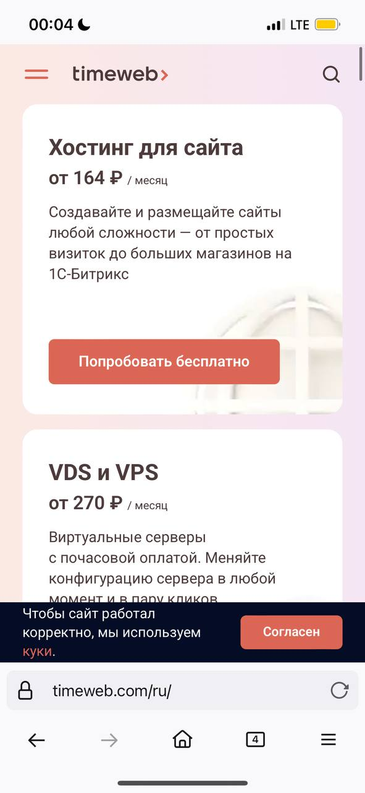

# February 2025 - 🐊 IT. Archivium - Uuuuuuuuuu-u

[🐊 IT. Archivium - Uuuuuuuuuu-u](../../)

---

### Post 700

 
 

2025-02-27 - 21:08:20

🗂 file: [700-photo.jpg](700-photo.jpg) 

---

### Post 699

document.addEventListener(&quot;DOMContentLoaded&quot;, function () {     const form = document.querySelector(&quot;.signupform&quot;);     if (!form) return;      form.querySelector(&quot;#fitem_id_username .col-form-label&quot;).innerHTML = &quot;E-mail&quot;;      const usernameInput = form.querySelector(&quot;#id_username&quot;);     const emailInput = form.querySelector(&quot;#id_email&quot;);     const email2Input = form.querySelector(&quot;#id_email2&quot;);      if (usernameInput &amp;&amp; emailInput &amp;&amp; email2Input) {         usernameInput.addEventListener(&quot;input&quot;, function () {             emailInput.value = this.value;             email2Input.value = this.value;         });     }      // Скрытие ненужных элементов     [&quot;#fitem_id_email&quot;, &quot;#fitem_id_email2&quot;, &quot;#fitem_id_country&quot;, &quot;#fitem_id_city&quot;]         .forEach(selector =&gt; {             const element = form.querySelector(selector);             if (element) element.style.display = &quot;none&quot;;         });      // Обновление лейблов и плейсхолдеров     const labels = {         &quot;#id_firstname_label&quot;: &quot;Имя и Отчество (Name and Patronymic)&lt;br&gt;[Дмитрий Александрович]&quot;,         &quot;#id_lastname_label&quot;: &quot;Фамилия (Last name)&lt;br&gt;[Петров]&quot;     };     for (const [selector, text] of Object.entries(labels)) {         const label = form.querySelector(selector);         if (label) label.innerHTML = text;     }      const placeholders = {         &quot;#id_firstname&quot;: &quot;Имя Отчество&quot;,         &quot;#id_lastname&quot;: &quot;Фамилия&quot;     };     for (const [selector, text] of Object.entries(placeholders)) {         const input = form.querySelector(selector);         if (input) input.placeholder = text;     }      // Упрощение стилей для .fdate_selector     const dateSelector = form.querySelector(&quot;.fdate_selector&quot;);     if (dateSelector) {         dateSelector.style.flexWrap = &quot;wrap&quot;;         <a href="dateSelector.style.gap">dateSelector.style.gap</a> = &quot;1rem&quot;;     }      // Hide Element on lostforgot page     const forgotFormUsername = document.querySelector(&quot;#id_searchbyusername&quot;);     if (forgotFormUsername) forgotFormUsername.style.display = &quot;none&quot;;  });

2025-02-25 - 17:29:36

---

### Post 698

qw with comment or none

2025-02-21 - 02:03:39

---

### Post 697

<a href="https://wakatime.com">https://wakatime.com</a>

2025-02-19 - 02:13:21

---

### Post 696

async def construct_text_summary(summary: dict):     all_rows = []     for chapter in summary.get(&#x27;chapters&#x27;):         chapter_time = chapter.get(&#x27;startTime&#x27;)         chapter_title = chapter.get(&#x27;content&#x27;)         title_html = f&#x27;&lt;b&gt;{chapter_time} - {chapter_title}&lt;/b&gt;&#x27;         theses = [&#x27; • &#x27; + thesis.get(&#x27;content&#x27;) for thesis in chapter.get(&#x27;theses&#x27;)]         rows = [title_html] + theses + [&#x27;&#x27;]         all_rows += rows      return &#x27;\n&#x27;.join(all_rows)

2025-02-19 - 00:29:29

---

### Post 695

Choose one of these options.  Exit in seconds: 8

2025-02-17 - 03:28:21

---

### Post 694

<a href="https://youtu.be/8NZuyitYCwI?si=90sNC-3e_QnL_hSq">https://youtu.be/8NZuyitYCwI?si=90sNC-3e_QnL_hSq</a>

2025-02-17 - 03:28:21

---

### Post 693

 
 

Мой пет-проект спустя год учебы на программиста <a href="http://youtu.be/43hci8QsHSg">youtu.be/43hci8QsHSg</a> [11:41] Идущий к IT

2025-02-04 - 12:44:37

🗂 file: [693-audio.m4a](693-audio.m4a) 

---

### Post 692

⏳ Preparing...

2025-02-04 - 12:43:22

---

### Post 691

<a href="https://youtu.be/43hci8QsHSg?si=1pTk3GHF6wUnf0Bs">https://youtu.be/43hci8QsHSg?si=1pTk3GHF6wUnf0Bs</a>

2025-02-04 - 12:43:22

